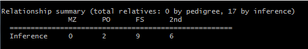

# Gastric protocol

## Protocol
<pre><code>

</code></pre>

### 1. Quality control
두번의 정도관리를 통해 low quality sample과 snp(marker)를 선별하는 작업
1차 QC에서는 주로 low quality sample을 선별하여 제거하고
2차 QC에서는 sample을 점검을 한 후 control data와 합쳐 이 후 작업(phasing, imputation, association 등)에 사용할 sample과 marker 선별.
이 때 1000genome project의 data와 함께 PCA 분석을 하여 QC가 잘 되었는지 확인 및 검증

#### 1.1 1st QC

##### 1.1.1 Genotype calling 
<pre><code> apt-genotype-axiom --analysis-files-path /home/genome/Downloads/apt-v1.1/Axiom_KORV1.1_Analysis --arg-file /home/genome/Downloads/apt-v1.1/Axiom_KORV1.1_Analysis/Axiom_KORV1_1_96orMore_Step2.r1.apt-genotype-axiom.AxiomGT1.apt2.xml --dual-channel-normalization true --cel-files cel_file_list.txt --summaries --write-models --out-dir outDir/
</code></pre>

##### 1.1.2 SNPolisher
* Advanced SNP quality control, genotyping, visualization
* remove low quality SNP
<pre><code> ps-metrics --posterior-file outDir/AxiomGT1.snp-posteriors.txt --call-file outDir/AxiomGT1.calls.txt --metrics-file outDir/AxiomGT1.out.txt

ps-classification --species-type human --metrics-file outDir/AxiomGT1.out.txt --output-dir outDir/

ps-classification-supplemental --performance-file outDir/Ps.performance.txt --summary-file outDir/AxiomGT1.summary.txt --call-file outDir/AxiomGT1.calls.txt --posterior-file outDir/AxiomGT1.snp-posteriors.txt --output-dir outDir/
</code></pre>

* plink를 이용하여 file merge
  * inputfile : ped, map
  * listfile.txt : ...ped\t...map
<pre><code> plink --file inputfile --merge_list listfile.txt --allow-no-sex --make-bed --out outputfile
</code></pre>

* SNPolisher를 통한 row quality SNP 제거
  * CallRateBelowThreshold : Call Rate Cut off 에 부합되지 않는 marker 
  * OffTargetVariant(OTV) : AA, AB, BB genotype 외에 다른 cluster 형성된 marker
  * Other : 어떠한 분류에도 해당하지 않는 marker

<pre><code>cat CallRateBelowThreshold.ps OffTargetVariant.ps Other.ps |sort | uniq  > rmSNP.txt
plink --bfile input --exclude rmSNP.txt --make-bed --out output
</code></pre>

##### 1.1.3 Sample QC
* Low call rate samples
  * low call rate samples은 DNA quality가 낮거나 실험상의 오류로 인해 발생할 수 있으므로 분석에서 제외
  * call rate : (1 - F_MISS)*100
  * --missing : missing rate 계산( F_MISS)
  * plink_missing.imiss file 생성

<pre><code> plink --bfile input --missing --out plink_missing
</code></pre>

* Excessive heterozygosity
  * Excessive heterozygosity일 경우 DNA quality가 낮거나 실험 중 sample contamination에 발생 가능성이 있으므로 제외
  * Missing을 AA 혹은 BB call로 채워줄 가능성이 있음 (calling bias)
  * Heterozygosity 계산 = (N(NM) - O(HOM)) / N(NM)
    (N(NM) : number of non-missing genotype, O(HOM)) : Observed number of homozygotes) 
  * --het : sample 별 homo, hetero genotype count 측정
  * plink_het.HET file 생성
<pre><code> plink --bfile plink --het --out plink_het
</code></pre>
    
* missing-het 값 이용하여 row quality sample 제거
  * R을 활용하여 missing, heterozygosity 값을 계산하여 기준 범위에 초과되는 sample을 제거
  * plot을 통해 threshold 설정(주로 het은 < 0.03)
  * R code
<pre><code>miss <-read.table("KNIH.RAW.Gastric.2nd.rmSNP.MISS.imiss",header = T)
het <- read.table("KNIH.RAW.Gastric.2nd.rmSNP.HET.het", header = T)

miss <- cbind(miss, CR=((1 - miss$F_MISS)*100))
het <- cbind(het, HET=((het$N.NM. - het$O.HOM.)/het$N.NM.)*100)

lowSample <- merge(miss, het, by="FID")

pdf("~/DATA/smkim/Gastric/QC_2nd/PDF/2nd_KNIH.RAW.Gastric.rmSNP.rmLQSamples.pdf", height = 7, width = 10)
plot(lowSample$HET, lowSample$F_MISS, xlim=c(10,25), ylim=c(0,0.1), xlab="heterozygosity rate",
     ylab="missing rate", main="2nd Missing vs heterozygosity", col=rgb(0,0,1,0.3), cex=1.5, pch=16)
abline(v=15.4, col=rgb(1,0,0,1), lty=3, lwd=2)
abline(v=17, col=rgb(1,0,0,1), lty=3, lwd=2)
abline(h=0.03, col=rgb(1,0,0,1), lty=3, lwd=2)
points(lowSample[lowSample$HET < 15.4 | 17 < lowSample$HET | 0.03 < lowSample$F_MISS,]$HET,
       lowSample[lowSample$HET < 15.4 | 17 < lowSample$HET | 0.03 < lowSample$F_MISS,]$F_MISS,
       col=rgb(1,0,0,0.3), cex=1.5, pch=16)
dev.off()

rmList <- lowSample[0.03 < lowSample$F_MISS | lowSample$HET < 15.4 | 17 < lowSample$HET,]
write.table(rmList[,c(1:2)], "rmLQSamples.txt", col.names= FALSE, row.names=FALSE, sep="\t", quote=FALSE)
</code></pre>
  * plink 이용하여 row quality sample 제거
<pre><code>plink --bfile plink --remove rmLQSamples.txt --make-bed --out plink_rmLQSamples</code></pre>

* SNP pruning
    * LD를 기반으로 대표 SNP 정보만 선별
    * 전체 데이터를 사용할 경우 매우 많은 시간이 소모
    * <pre><code>plink --bfile plink --maf 0.5 --geno 0.05 --hwe 0.001 --indep-pairwase 50 5 0.5 --out plink</code></pre>
    * --maf : Minor Allel Frequency 기준으로 제시된 수치 미만의 SNP 제외
    * --geno : SNP의 missing rate(1-call rate)가 제시된 수치를 초과한 SNP은 제외
    * --hwe : Hardy Weinberg Equilibrium을 만족하지 않는  SNP제외
    * --extract : 해당 SNP 제거
<pre><code>plink --bfile plink --maf 0.5 --geno 0.05 --hwe 0.001 --extract chr6_14.txt --indep-pairwase 50 5 0.5 --out plink</code></pre>

* PCA : Principal component analysis
  * Reduce data dimension and minimum information loss
  * population stratification 등의 가능성 존재
  * 전체 샘플에서 벗어나는 sample 분석에서 제외 - plot을 그려서 확인
  * ??PCA.txt 를 보면 PC1~10이 나온다. 1로 갈 수 더 중요한 분석결과?!
  * P < 1e-6이  모두 CHR6,14에 있는 것으로 확인 됨, 해당 SNP 제거( LD관계가 밀집되어 있고 MHC region(6번)가 있어서 연관성이 크다고 크다고 나와 있을 수 있음)
<pre><code>flashpca --bfile KNIH.RAW.Gastric.rmSNP.SNP.Pruned --outpc PCA.txt
</code></pre>

* PCA plot 후 sample 제거
  * plot 그리고 sample 뽑기
<pre><code>pca <- read.table("PCA.txt", header=T)

pdf("../PDF/KNIH.RAW.Gastric.rmSNP.SNP.Pruned.PCA.txt.pdf", height = 10, width = 10)
plot(pca$PC1, pca$PC2, col=rgb(0,0,1,0.3), xlim=c(-0.2, 0.2), ylim=c(-0.15,0.15),
        xlab="PC1", ylab="PC2", main="PCA", cex=1.5, pch=16)
abline(v=-0.1, col=rgb(1,0,0,0.5), lty=3, lwd=2)
abline(v=0.1, col=rgb(1,0,0,0.5), lty=3, lwd=2)
abline(h=0.1, col=rgb(1,0,0,0.5), lty=3, lwd=2)
abline(h=-0.1, col=rgb(1,0,0,0.5), lty=3, lwd=2)
points(pca[pca$PC1 < -0.1 | 0.1 < pca$PC1 | pca$PC2 < -0.1 | 0.1 < pca$PC2,]$PC1,
       pca[pca$PC1 < -0.1 | 0.1 < pca$PC1 | pca$PC2 < -0.1 | 0.1 < pca$PC2,]$PC2,
       col=rgb(1,0,0,0.3), cex=1.5, pch=16)
dev.off()

rmList <- pca[pca$PC1 < -0.21 | 0.21 < pca$PC1 | pca$PC2 < -0.21 | 0.21 < pca$PC2,]
write.table(rmList[,c(1:2)], "rmPCA.txt", col.names= FALSE, row.names=FALSE, sep="\t", quote=FALSE)
</code></pre> 

#### 1.2 2nd QC

<pre><code>

</code></pre>  
##### 1.2.1 Genotype calling
 * Do remove low qaulity samples which are from 1st sample QC before 2nd genotype calling, 
 * Use different`
#### 1.2.2 SNPolisher (by batch)
 * 이전과 같음
#### 1.2.3 SNP QC  & Sample QC(by batch)
 * 이전과 같음
   * missing - hetrozygosity 계산하여 저품질 샘플 제거
 * 추가된 사항 
   * affy ID 가지고 있는 SNP 제거
   * duplicated SNP 중 frequency 낮거나 missing rate높은 SNP 제거
   * indel 처리
   * filp 처리
   * Relationship inference
 ##### 1.2.3.1 Sample QC
 * 저품질 sample 제거(이전과 같은) - R 이용하여 리스트를 뽑을 후 plink이용하여 제거
 ##### 1.2.3.2 SNP QC
 * 나중에 control data와 merge할때 필요없는 데이터와 분석에 문제가 생기는 SNP QC
 * remove affy ID SNP
 <pre><code> plink --bfile kchip.2nd --exclude affy_snp_list.txt --make-bed --out kchip.2nd_rmaffy
</code></pre>  
 * remove duplicated SNP 
   * 중복된 SNP들이 있어 나중에 분석시 오류나 warning이 생김
   * plink를 통해 missing rate과 duplicated SNP list 뽑기
<pre><code> plink --bfile kchip.2nd_rmaffy --missing --list-dupicate-vars --out kchip.2nd_rmaffy
</code></pre>  
   * output file : .lmiss, .imiss, .dupvar 등 파일 생성
     * .imiss 이전에 사용한 파일, sample에 대한 missing rate
     * .lmiss : SNP에 대한 missing rate
     * .dupvar : duplicated 된 position과 SNP ID    
   * .lmiss file과 .dupvar를 이용하여 duplicated SNP 중 missing rate가 높은 SNP 선정하여 list 만들기
   * plink --exclude를 사용하여 duplicated SNP 제거
<pre><code> plink --bfile kchip.2nd_rmaffy --exclude duplicated_list.txt --make-bed --out kchip.2nd_rmaffy_rmdup
</code></pre>  
 * indel change
   * 순서 : Convertobim --> indel
   * 기존에 만든 python 파일을 이용

<pre><code> python ConverToBim.py (ref.txt) (input name) (output name)
 python ConvertToBim.py Axiom_KORV1_1.na35.annot.extract.txt kchip.2nd_rmaffy_rmdup kchip.2nd_rmaffy_rmdup_convert

 python indelChange.py (ref.txt) (input name) (output name)
 python indelChange.py Axiom_KORV1_1.na35.annot.extract.onlyINDEL.txt kchip.2nd.*.convert kchip.2nd.*.convert_indel
</code></pre>  
  * flip : 
    * <pre><code> plink --bfile kchip.2nd.*.convert_indel --flip Flip.txt --make-bed --out kchip.*.filp 
</code></pre>
 ##### 1.2.3.2 Relationship inference 
 
 * 가족관계 가능성이 있는 경우 분석에서 제외
 * king 프로그램을 이용하여 분석
 <pre><code> king -b plink.bed --related --cluster --rplot --degree 2 --cpu 5 --prefix plink_king
</code></pre>  
   * -b : input plink.bed file
   * --related : 관계 분석. 결과 파일 .kin0 생성
   * --cluster : 관계 분석, 가족 관계성 있는 것 끼리 grouping, .kin 파일 생성
   * --degree [num] : num 촌수까지 결과 생성
   * --rplot : 관계도와 결과를 plot으로 나타냄
   * --cpu [num]: 사용할 croe 수
   * --prefix : output file name
 * example result :
 
 * kinship column값을 확인
  * monozygotic twins (MZ) : 
  * full-siblings (FS) : 0.354~
  * parent-offspring (PO) : (0.177, 0.354]
  * 2nd degree : (0.0884,0.177]
 * kinship과 relationship을 확인하여 ~2nd degree 까지 sample 추출
 <pre><code> grep -E "DUZ|PO|FS|2nd" plink_king.kin0 | awk '{print $1'\t'$1}' > rmking.txt
 plink --bfile plink --remove rmking.txt --make-bed --out plink_rmking
</code></pre>  
 
#### 1.4 SNP QC
 * case와 Control 데이터를 merge 하기 위한 SNP QC
 * 우선 SNP QC 를 한 후 공동된 marker를 찾고 frequency를 check하여 데이터의 이상이 있는 freq를 제거 해준다...
 * csae control snp QC option은 연구에 따라 정한다.
##### 1.4.1 

### 2. Phasing & Imputation
#### 2.1 Pre-processing
 * split plink file
   * 
 * map file, ref file,
#### 2.2 Phasing

#### 2.3 Imputation
### 2. Association
#### 2.1 Imputation
#### 2.2 Association
#### 2.3 Annotation & Visualization
## Data handling
## command
## Tool

## Protocol

### 1. Quality control
This process call QC. 
#### 1.1 Genotype calling
To make plink file.
Original chip data format is CEL file. 
We need to change Plink file format(ped and map).
First genotype call using APT ( Affymetrix Power Tool) 

In this step, it needs CEL files and CEL files list txt(colnames : cel_files)

#### 1.2 SNPolisher (by batch)

#### 1.3 Sample QC (by batch)
#### 1.4 merge
#### 1.4 SNP QC

### 2. Association
#### 2.1 Imputation
#### 2.2 Association
#### 2.3 Annotation & Visualization

## Data handling
#### VCF file to data frame in R
VCF (수정필요) vcf file로 실습 안해봄

<pre><code>
a <- read.table("")
#colname
b <- readLines("c:/Users/user/Desktop/snpEff_summary_genome20.genes.txt",n = 2)[2]
c <- gsub("#","",b)   # 파일에 있는 # --> "" 빈공간으로 바꾸기
d <- strsplit(c,"\t") # 다시 그 string을 \t로 구분
e =a
colnames(e)<-unlist(d) #list type으로 되어 있는 d 를 unlist 해준다!
</code></pre>

