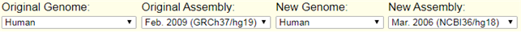

This is a memo about HLA imputation

# HLA imputation

Human Leukocyte Antigen

## Why is it important to research HLA?
 HLA 
 - chromosome 6, short arm
 - 5Mb에 걸처 several genes --> glycoprotein
	 - HG19 : chr6 : 29691116–33054976
 - 인체 내 모든 조직세포의 표면에 표현, 백혈구, 혈소판 등 혈액세포에도 표현됨
 - ABO 다음으로 중요한 antigen

## HLA imputation tool comparison

## HLA imputation using Cook HLA

### 1. QC for HLA imputation (genotype panel)
#### 1.0. QCed genotype data
 - sample QC가 완료된 genotype data 준비
 - HLA region 추출
<pre><code>plink QCed --chr 6 --from-bp 29691116 --to-bp 33054976 --maf 0.01 --geno 0.05 --hwe 1e-6 --make-bed --out QCed.HLA
</code></pre>
#### 1.1 Remove Ambiguous allele 
<pre><code>awk '{if($5 == "C" && $6 == "G") print $2}' > ambg.snp
awk '{if($5 == "A" && $6 == "T") print $2}' >> ambg.snp
awk '{if($5 == "G" && $6 == "C") print $2}' >> ambg.snp
awk '{if($5 == "T" && $6 == "A") print $2}' >> ambg.snp
plink --bfile QCed.HLA --exclude --make-bed --out QCed.HLA.rmAmbiguous
</code></pre>
#### 1.2 liftover
 - liftover는 genome build를 변화 시키는 것
	- 예) hg19 --> hg17
 - 한국인칩 같은 경우 hg19로 되어 있기에 hg19를 reference panel build와 맞추어 liftover 진행
 - 우선 genotype panel에서 SNP 정보가 필요. 
	- 형식 : chr1:1234-1234
	- awk 를 이용하여 해당 SNP 정보 list file 만들기
<pre><code>awk '{print "chr6:"$4"-"$4"}' QCed.HLA_rmAmbiguous.bim >  chr6.position.txt
</code></pre>
 - ucsc liftover tool를 이용 (https://genome.ucsc.edu/cgi-bin/hgLiftOver)
	- 예) UCSC liftover tool

		- Original : 기존 build (한국인칩)
		- New : 바꾸려고 하는 build
	- 'chr6.position.txt' 파일 업로드 후 liftover 진행
	

### 2. HLA imputation
