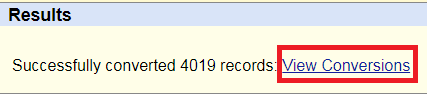

This is a memo about HLA imputation

# HLA imputation

Human Leukocyte Antigen

## Why is it important to research HLA?
 HLA 
 - chromosome 6, short arm
 - 5Mb에 걸처 several genes --> glycoprotein
	 - HG19 : chr6 : 29691116–33054976
 - 인체 내 모든 조직세포의 표면에 표현, 백혈구, 혈소판 등 혈액세포에도 표현됨
 - ABO 다음으로 중요한 antigen

## HLA imputation tool comparison

## HLA imputation using Cook HLA

### 1. QC for HLA imputation (genotype panel)
#### 1.0. QCed genotype data
 - sample QC가 완료된 genotype data 준비
 - HLA region 추출
<pre><code>plink QCed --chr 6 --from-bp 29691116 --to-bp 33054976 --maf 0.01 --geno 0.05 --hwe 1e-6 --make-bed --out QCed.HLA
</code></pre>
#### 1.1 Remove Ambiguous allele 
<pre><code>awk '{if($5 == "C" && $6 == "G") print $2}' > ambg.snp
awk '{if($5 == "A" && $6 == "T") print $2}' >> ambg.snp
awk '{if($5 == "G" && $6 == "C") print $2}' >> ambg.snp
awk '{if($5 == "T" && $6 == "A") print $2}' >> ambg.snp
plink --bfile QCed.HLA --exclude --make-bed --out QCed.HLA.rmAmbiguous
</code></pre>
#### 1.2 liftover
 - liftover는 genome build를 변화 시키는 것
	- 예) hg19 --> hg17
 - 한국인칩 같은 경우 hg19로 되어 있기에 hg19를 reference panel build와 맞추어 liftover 진행
 - 우선 genotype panel에서 SNP 정보가 필요. 
	- 형식 : chr1:1234-1234
	- awk 를 이용하여 해당 SNP 정보 list file 만들기

<pre><code>awk '{print "chr6:"$4"-"$4"}' QCed.HLA_rmAmbiguous.bim >  chr6.position.txt
</code></pre>
 - ucsc liftover tool를 이용 (https://genome.ucsc.edu/cgi-bin/hgLiftOver)
	- 예) UCSC liftover tool
	
		- Original : 기존 build (한국인칩)
		- New : 바꾸려고 하는 build
	- 'chr6.position.txt' 파일 업로드 후 liftover 진행
	
		- '파일선택' 클릭 후 'chr6.position.txt' 업로드
                - 'submit' 클릭하면 liftover 진행
	- 결과 파일 다운로드
	
		- liftover 진행 완료 후 위 그림 같은 Result 창이 생기며, 'View Conversions' 클릭하면 결과 파일이 다운로드
		- input file 순서와 output 파일 순서는 같으므로, .bim 파일의 position 정보를 수정해주어야 
		- 주의 : 만약 SNP 정보가 해당 bulid에 없을 경우 없는 snp은 실패 했다고 나옴. 
	* 처리 방법..........(수정예정)
 - .bim position 정보 변경
	- liftover output file preprocessing
		- 파일 형식이 chr1:1234-1234 으로 되어 있어서, position 정보만 추출하여 변경
		<pre><code> awk '{split($1,a,"-"); print a[2]}' lift.over.outputfile.bed > ref.hg18.txt </code></pre> 		
	- bim 파일 position 정보 수정
		- 원본 파일을 따로 저장(오류가 날 수도 있으므로...)
		<pre><code>cp QCed.HLA_rmAmbiguous.bim QCed.HLA_rmAmbiguous.bim.hg19</pre></code>		
		- 4번째 column의 position 정보를 ref.hg18.txt로 수정
<pre><code>R
df <- read.table("QCed.HLA_rmAmbiguous.bim")
ref <- read.table("ref.hg18.txt")
df <- cbind(df,ref)
write.table(df[,c(1,2,3,7,5,6)],"QCed.HLA_rmAmbiguous.bim",col.names = F, row.names = F, quote = F, sep = "\t")
</code></pre>

 - reference file과 공통된 SNP 추출
 	- reference file과 genotype panel 공통된 SNP 추출
	- perl script(by Young Jin Kim)를 이용하여 .bim 파일 SNP ID 변경
	<pre><code> perl update_genotype_panel_bim.pl [reference panel.bim 파일]  [genotype panel.bim 파일] </pre></code>
	- reference file 형식마다 분석 방법이 다름
		- HAN reference : 직접 다운 받고 CookHLA format에 맞게 직접 가공한 것
			- SNP ID 가 postion으로 되어 있음
		- Pan-Kor reference : CookHLA format에 맞게 되어 있음 
			- SNP ID 가 rs number로 되어 있음

### 2. HLA imputation
함
