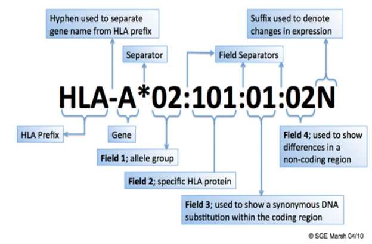
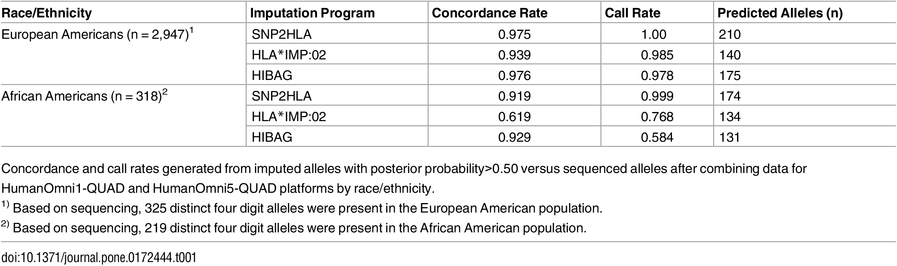
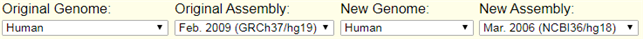
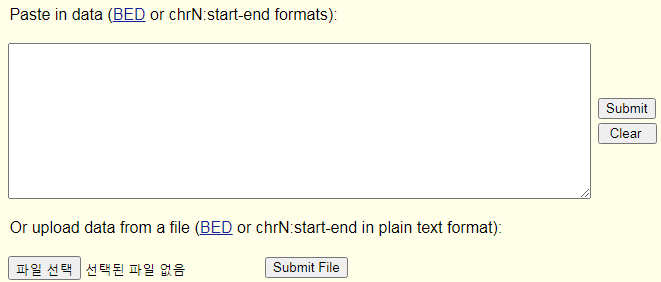
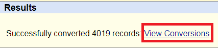
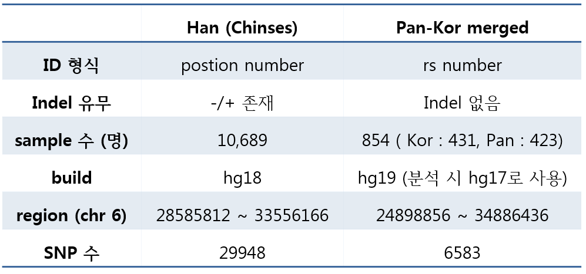
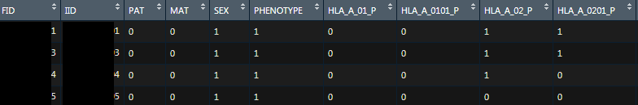

This is a protocol about HLA imputation

# HLA imputation

Human Leukocyte Antigen

## HLA?
### 1. Why is it important to research HLA?
 HLA 
 - chromosome 6, short arm
 - 5Mb에 걸처 several genes --> glycoprotein
	 - HG19 : chr6 : 29691116–33054976
 - 인체 내 모든 조직세포의 표면에 표현, 백혈구, 혈소판 등 혈액세포에도 표현됨
 - ABO 다음으로 중요한 antigen
### 2. HLA Nomenclature
(http://hla.alleles.org/nomenclature/naming.html)  
- 예) HLA-B*15:01:01:02N  

| 표현 | 의미 | 풀이 
|:------|:------|:-----|  
HLA-B| HLA-B genetic locus  
HLA-B* | Locus와 allele 명칭 사이에 * 표시  
HLA-B*15 | HLA-B15 antigen,   a group of allele | 염기 유사성이 높음 group - 2digit
HLA-B*15:01 | a specific HLA allele |exon 부위에 염기서열 차이가 있고, 아미노선 변이도 동반되는 allele - 4digit
HLA-B*15:01:01 |
HLA-B*15:01:01:02 |
HLA-B*15:01:01:02N | 

### 3. HLA imputation tool comparison

## HLA imputation using Cook HLA

### 1. QC for HLA imputation (genotype panel)
#### 1.0. QCed genotype data
 - sample QC가 완료된 genotype data 준비
 - HLA region 추출
<pre><code>plink QCed --chr 6 --from-bp 29691116 --to-bp 33054976 --maf 0.01 --geno 0.05 --hwe 1e-6 --make-bed --out QCed.HLA
</code></pre>
	- (생각해보니.. 여기서 HLA region은 build에 맞추어 뽑거나.. reference panel 크기에 맞게 범위를 설정하면 더 많은 SNP 정보가 들어갈 것 같다는 생각이 듬..)
#### 1.1 Remove Ambiguous allele 
<pre><code>awk '{if($5 == "C" && $6 == "G") print $2}' > ambg.snp
awk '{if($5 == "A" && $6 == "T") print $2}' >> ambg.snp
awk '{if($5 == "G" && $6 == "C") print $2}' >> ambg.snp
awk '{if($5 == "T" && $6 == "A") print $2}' >> ambg.snp
plink --bfile QCed.HLA --exclude ambg.snp --make-bed --out QCed.HLA.rmAmbiguous
</code></pre>
#### 1.2 liftover
 - liftover는 genome build를 변화 시키는 것
	- 예) hg19 --> hg17
 - 한국인칩 같은 경우 hg19로 되어 있기에 hg19를 reference panel build와 맞추어 liftover 진행
 - 우선 genotype panel에서 SNP 정보가 필요. 
	- 형식 : chr1:1234-1234
	- awk 를 이용하여 해당 SNP 정보 list file 만들기

<pre><code>awk '{print "chr6:"$4"-"$4"}' QCed.HLA_rmAmbiguous.bim >  chr6.position.txt
</code></pre>
 - ucsc liftover tool를 이용 (https://genome.ucsc.edu/cgi-bin/hgLiftOver)
	- 예) UCSC liftover tool  
		
		- Original : 기존 build (한국인칩)
		- New : 바꾸려고 하는 build
	- 'chr6.position.txt' 파일 업로드 후 liftover 진행  
		
		- '파일선택' 클릭 후 'chr6.position.txt' 업로드
                - 'submit' 클릭하면 liftover 진행
	- 결과 파일 다운로드  
		
		- liftover 진행 완료 후 위 그림 같은 Result 창이 생기며, 'View Conversions' 클릭하면 결과 파일이 다운로드
		- input file 순서와 output 파일 순서는 같으므로, .bim 파일의 position 정보를 수정해주어야 
		- 주의 : 만약 SNP 정보가 해당 bulid에 없을 경우 없는 snp은 실패 했다고 나옴. 
	* 처리 방법..........(수정예정)
 - .bim position 정보 변경
	- liftover output file preprocessing
		- 파일 형식이 chr1:1234-1234 으로 되어 있어서, position 정보만 추출하여 변경
		<pre><code> awk '{split($1,a,"-"); print a[2]}' lift.over.outputfile.bed > ref.hg18.txt </code></pre> 		
	- bim 파일 position 정보 수정
		- 원본 파일을 따로 저장(오류가 날 수도 있으므로...)
		<pre><code>cp QCed.HLA_rmAmbiguous.bim QCed.HLA_rmAmbiguous.bim.hg19</pre></code>		
		- 4번째 column의 position 정보를 ref.hg18.txt로 수정
<pre><code>R
df <- read.table("QCed.HLA_rmAmbiguous.bim")
ref <- read.table("ref.hg18.txt")
df <- cbind(df,ref)
write.table(df[,c(1,2,3,7,5,6)],"QCed.HLA_rmAmbiguous.bim",col.names = F, row.names = F, quote = F, sep = "\t")
</code></pre>

#### 1.3 reference file과 공통된 SNP 추출
- reference file과 genotype panel 공통된 SNP 추출
- perl script(by Young Jin Kim)를 이용하여 .bim 파일 SNP ID 변경
<pre><code> perl update_genotype_panel_bim.pl [reference panel.bim 파일]  [genotype panel.bim 파일] </pre></code>
* reference panel .bim 파일의 SNP와 공통된 SNP를 찾아 bim파일의 ID를 변경
* output file로 .bim.org(기존 bim), .bim(변경된 bim) 생성
- reference file 형식마다 분석 방법이 다름

	- Pan-Kor reference : rs ID로  되어 있음
	<pre><code>  perl update_genotype_panel_bim.pl Pan.Korea.ref.panel.bim QCed.HLA_rmAmbiguous
	awk '{if($2 ~ /rs/) print $2}' QCed.HLA_rmAmbiguous.bim > rs.snp
	plink --bfile QCed.HLA_rmAmbiguous --extract rs.snp --make-bed --out QCed.HLA_rmAmbiguous_SNPuse </code></pre>
	- Han-Chinese : postion이 SNP ID로 되어 있음
	<pre><code>  perl update_genotype_panel_bim.pl HAN.ref.panel.bim QCed.HLA_rmAmbiguous
	cat HAN.ref.panel.bim QCed.HLA_rmAmbiguous.bim | awk '{print $2}' | sort | uniq -c | awk '{print $2}' > snp.use
	plink --bfile QCed.HLA_rmAmbiguous --extract snp.use --make-bed --out QCed.HLA_rmAmbiguous_SNPuse</code></pre>
- 정도관리가 완료된 genotype panel을 이용하여 추가 분석 진행

### 2. HLA imputation
#### 2.1 make genetic map
 - 사전 준비 사항 
 	- c-shell 설치
	<pre><code>sudo apt-get install csh</code></pre>
	- plink 1.9 이하 version  (2.0은 안됨)
	- mach1 파일 점검
		- kernel에 따라서 실행이 안되는 경우가 있어서 source code 다운 받고 complie 진행
		- mach1 source 경로 : http://csg.sph.umich.edu/abecasis/mach/download/
		- mach1 source 파일 열고 'CFLAGS' 에 -static 옵션 삭제 후 저장한 후 complie (make all)
	- reference panel
		- .bgl, bgl.markers (beagle 파일)
		- .bim, .fam, .bed, .FRQ.frq (plink 파일)
		* frq 파일이 없을 경우 이름을 꼭 .FRQ.frq로 하여 생성
		<pre><code>plink --bfile reference --freq --out reference.FRQ</code></pre>
	- genotype panel
		- 위에서 작업한 정도관리가 완료된 gentoype panel 준비
 - make genetic map
 	- 기본 코드
 	<pre><code>./MakeGeneticMap_MHC.csh DATA (.bed/.bim/.fam) REFERENCE (.bgl.phased/.markers) OUTPUT plink </code></pre> 
	- 예시
	<pre><code>./MakeGeneticMap_MHC.csh QCed.HLA_rmAmbiguous referencepanel my_genmap ./plink </code></pre> 
	- my_genmap : output file 이름설정 (outpuf file :  my_genmap.genetic.map, my_genmap.aver.erate )
	- ./plink : 작업폴더에 있거나 command(plink)로 사용
	
#### 2.2 cookHLA
 - HLA imputation
 	- 기본 코드
	 <pre><code>./COOKHLA.csh DATA (.bed/.bim/.fam) REFERENCE (.bgl.phased/.markers) OUTPUT plink geneticMap erate {optional: java_max_memory[mb]}</code></pre>
	- 예시
	<pre><code>./COOKHLA.csv QCed.HLA_rmAmbiguous referencepanel HLA.imputed ./plink my_genmap.genetic.map my_genmap.aver.erate 5000</code></pre>
	- output file : HLA_IMPUTED_Result.HLA.imputed.MHC 이름을 가진 plink 파일 생성
	- bim fam bed ped map
 - HLA allele extract
 	- .bim 파일에 있는 HLA type 정보만 추출
	<pre><code> awk '{if($2 ~/HLA/)print $2}' HLA_IMPUTED_Result.HLA.imputed.MHC.bim > HLA.allele.txt
	plink --bfile HLA_IMPUTED_Result.HLA.imputed.MHC --extract HLA.allele.txt --make-bed --out HLA.imputation </code></pre>
	
	- RecodeA
		- plink --recodeA 옵션을 사용하여 plink data를 data frqme형식으로 바꾸어 데이터처리 하기 편한 형태로 만듬
		<pre><code> plink --bfile HLA.imputation --recodeA --out HLA.imputation_RAW</code></pre>
		- output file : HLA.imputation_RAW.raw
		
		- .raw 파일 R로 읽은 모습이 위 그림
		- 예)  HLA_A_01_P : (2digit) HLA A locus의 01 allele group 
		       HLA_A_0101_P : (4digit) HLA A locus의 01 allele group
### 3. Data processing
<pre><code></code></pre>

# Reference
## Paper
## Software
## website
 - HLA : http://hla.alleles.org/
 - HLA 명명법 한글 설명 : https://labmusiclm.tistory.com/105

1. 
